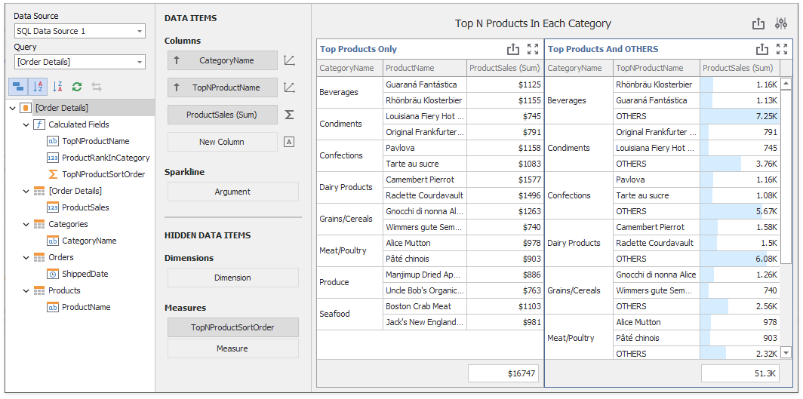

<!-- default file list -->
*Files to look at*:

* [WF_Filter_TopNInGroup.xml](./CS/WFunctionSample/Data/WF_Filter_TopNInGroup.xml)
<!-- default file list end -->

# Dashboard for WinForms - How to Use the W Function to Show Top N Products by Category

This example demonstrates how to show the products with top N sales by category.

The dashboard contains calculated fields with the following expressions:

| Field | Expression |
| --- | --- |
| ProductRankInCategory | aggr(w(RankDense(Sum([ProductSales]), 'desc'), PartitionBy([CategoryName]), OrderBy()), [CategoryName], [ProductName])

The grid shows the products with the **ProductRankInCategory** value that is more or equal to the parameter value (default value is 2).

Grid rows in the _Top Products_ and _OTHERS_ are sorted by the 
**TopNProductsSortOrder** calculated field for proper arrangement.

## Documentation

* [Data Analysis](https://docs.devexpress.com/Dashboard/115868/winforms-dashboard/winforms-designer/create-dashboards-in-the-winforms-designer/data-analysis)
* [w Function - Window Calculations at the Intermediate Aggregation Level](https://docs.devexpress.com/Dashboard/401421/common-features/advanced-analytics/aggregations/w-function-aggregation-intermediate-level)

## More Examples

- [Dashboard for WinForms - How to display best and worst monthly sales for each year](https://github.com/DevExpress-Examples/how-to-display-best-and-worst-monthly-sales-for-each-year-t369371)
- [Dashboard for WinForms - How to Calculate the Contribution of Quarterly Sales to Total Yearly Sales](https://github.com/DevExpress-Examples/how-to-calculate-the-contribution-of-quarterly-sales-to-total-yearly-sales)
- [Dashboard for WinForms - How to evaluate a customer acquisition using the quarter/year of their first purchase](https://github.com/DevExpress-Examples/how-to-divide-customers-count-by-the-number-of-orders-they-made-t372356)
- [Dashboard for WinForms - How to divide customers' count by the number of orders they made](https://github.com/DevExpress-Examples/how-to-divide-customers-count-by-the-number-of-orders-they-made-t372356)
- [Dashboard for WinForms - How to calculate Highest Product Sales by Year](https://github.com/DevExpress-Examples/how-to-show-products-with-the-best-sales-in-a-year-along-with-sales-values-t372408)
- [Dashboard for WinForms - How to display sales by years in comparison with the previous year's sales](https://github.com/DevExpress-Examples/win-dashboard-display-previous-year-sales)
- [Dashboard for WinForms - How to Display Product Sales that are Greater than $20k](https://github.com/DevExpress-Examples/How-to-Display-Product-Sales-that-are-Greater-than-20k)
- [Dashboard for WinForms - How to Display Products with Sales Greater than Average Sales per Category](https://github.com/DevExpress-Examples/How-to-Display-Product-with-Sales-Greater-than-Average-Sales-per-Category)
